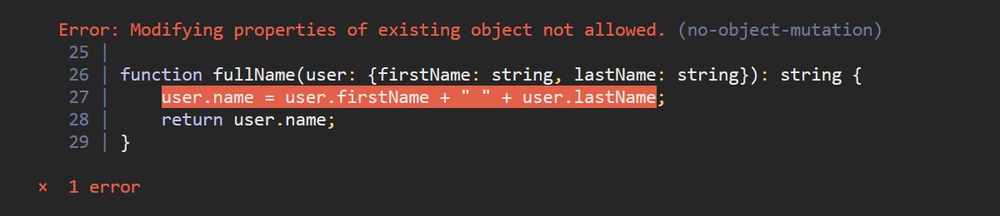

# Mutating Arrays / Objects

Best practices for immutability in modern Javascript/TypeScript.



## Objects
**Not Allowed**

```ts
function userWithFullName(user: {firstName: string; lastName: string}) {
    // Mutating data-objects is not allowed
    user.name = user.firstName + " " + user.lastName;
    return user;
}
```

**Good**

```ts
function userWithFullName(user: {firstName: string; lastName: string}) {
    // a new object should be created instead
    return {
        ...user,
        name: user.firstName + " " + user.lastName,
    };
}
```

**Good**

```ts
function userWithoutEmail(user: {email: string, firstName: string; lastName: string}) {
    // omit fields using destructuring
    const { email, ...result } = user;
    return result;
}
```

- Add field &rarr; create new object using spread operator
- Change value &rarr; create new object using spread operator
- Omit field &rarr; destructure object using spread operator


## Arrays
**Not Allowed**

```ts
function addMessage(messageList: string[], message: string) {
    // Mutating arrays is not allowed
    messageList.push(message);
    return messageList;
}
```

**Good**

```ts
function addMessage(messageList: string[], message: string) {
    // create a new array using concat
    return messageList.concat([message]);
}
```

**Good**

```ts
function removeMessage(messageList: string[], message: string) {
    // create a new array using filter
    return messageList.filter(msg => msg !== message);
}
```

- Add item &rarr; .concat( [item] )
- Remove item &rarr; .filter(x => x !== item)

## Immutability

**Mutation &rarr; Side-Effects &rarr; Bugs**

When handing over data-objects to other components or functions.
- They might change the data
- Values may get changed
- Fields may get added or removed

For a developer to figure out the data-object later. He must inspect the components, subcomponents, functions etc.
- Expensive (costs time and nerves)
- Unreliable

Any file in the project, with access to the data-object. May introduce code to mutate it in unexpected ways.
Possibly breaking any other file, with access to that data-object.


**ERTS prevents every developer on a project from introducing such costly bugs.**


## Libraries

For most projects. Typescript has enough tools to achieve Immutability and Type-Safety. Without any extra dependencies.

The examples above should be sufficient for most use-cases.

### Deep Equality

Comparing 2 objects for deep equality very quickly. In O(1). By just comparing Hash-Values.

This feature is not available with default methods. A library like ImmutableJS is required. 
Libraries, like that, come with heavy trade-offs. Especially regarding Type-Safety.

It should be considered carefully if this feature is actually ever needed. It usually is not. Typically it is useful for memoization in high performance rendering methods.

Also consider, checking for deep equality "slowly". Is usually fast enough.