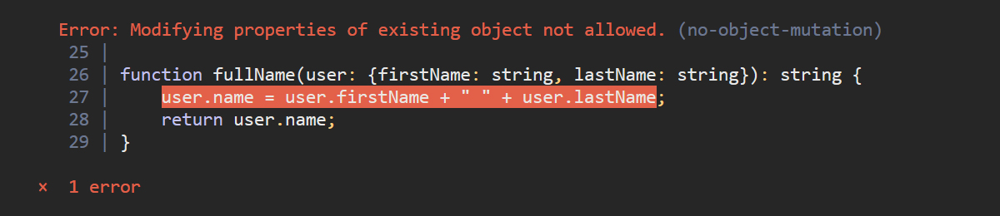
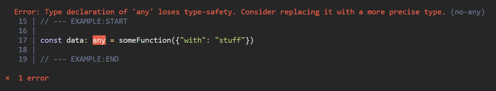

# Extremely Restrictive TypeScript

- **Unbreakable Code** - 95% less runtime bugs
- **Exhaustive Programming** - it compiles == it runs
- **Immutable Data** - enforced at compile-time
- **Code Formatting** - automatic on save
- **IntelliSense** - for everything
- **Mature Tooling** - TypeScript, TSLint, webpack


<br><br>
## What it is
ERTS is a project boilerplate. 
- Webpack
- TypeScript
- TSLint *(+custom rules)*
- React
- io-ts *(JS-Lib to type external data)*

The TypeScript compiler and TSLint enforce Best Practices. To make sure everything is typed and data is immutable.

- [Best Practices - Immutability](best-array-obj.md)
- [Best Practices - Typing all the JSON](best-json.md)
- [Best Practices - Union Types](best-union-types.md)
- [Best Practices - Error Handling](best-error-handling.md)


<br><br>
## Get started
```bash
git clone git@github.com:julius/ERTS-boilerplate.git && cd ERTS-boilerplate
yarn install
yarn start
```

A premade basic React web application will start up. It already demos typical tasks like 
- Loading data from an API
- Routing
- Translations

[https://github.com/julius/ERTS-boilerplate](https://github.com/julius/ERTS-boilerplate)


<br><br>
## 95% reduction of Runtime Exception Bugs


Preventing the most common Bugs in Frontend-Web-Development.

- ERTS reduces costs on QA-Time *(less bugs in version 1 &rarr; less iterations)*
- ERTS reduces costs on Developer-Time *(less iterations)*

- Relying only on industry standart tooling (npm/yarn, webpack, typescript, tslint)

- Recommending established frameworks (React)

Typical Frontend Developers can use ERTS immediately. Usually they are fully productive within days.

Inexperienced Developers have a hard time introducing long lasting bugs. Good practices are enforced at compile-time.

<br><br>
## Your Code will not break at runtime
Extremely Restrictive Compiler




- [ERTS Concepts](overview-concepts.md)
- [Best Practices - Immutability](best-array-obj.md)
- [Best Practices - Typing all the JSON](best-json.md)
- [Best Practices - Union Types](best-union-types.md)
- [Best Practices - Error Handling](best-error-handling.md)
