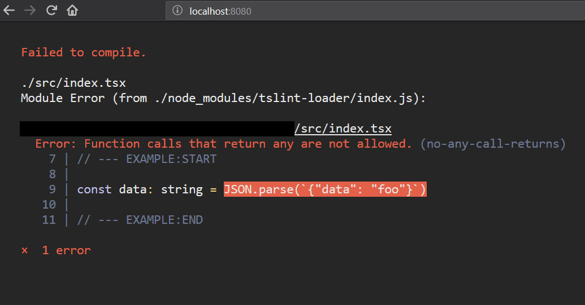

# Concepts

- Catch 95% of the bugs at compile time
- Catch 90% while typing into the IDE text-editor
- Rarely encounter Runtime Exceptions

## Core Features

- Extremely Typed
    - API Response Typings are enforced
    - Any external data must be typed
    - JSON.parse is not allowed 
    - [Best Practices - Typing JSON](best-json.md)

- Immutable Data
    - Compiler prevents mutation of objects and arrays
    - No more Bugs from unexpected side-effects
    - [Best Practices - Immutability](best-array-obj.md)

- Exhaustive Programming
    - Compiler enforces edge-case handling
    - Union Types &rarr; declare all states explicitly
    - [Best Practices - Union Types](best-union-types.md)

- Great IDE Support 
    - ERTS is just a configuration of TypeScript and TSLint 
    - VSCode Setup: Optionally install TSLint Plugin
    - IntelliSense everywhere. Typing is extremely enforced.

