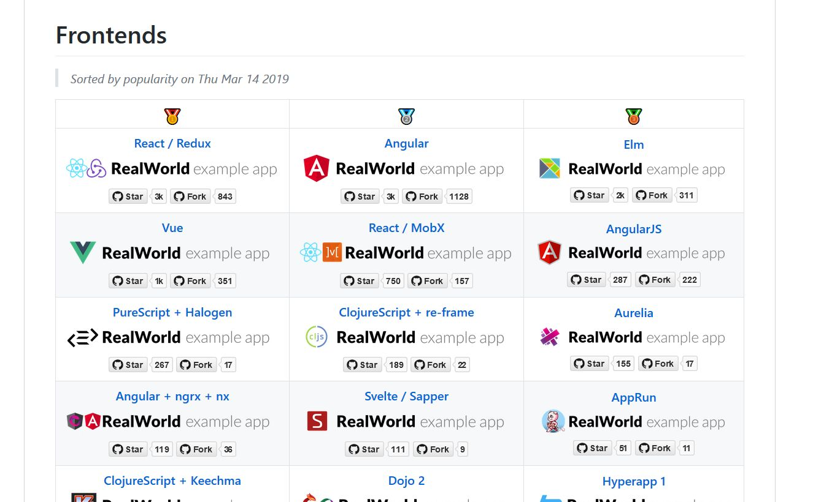

# RealWorld Example App

- Frontend for a social-blogging platform
- Realistic code base (vs the common TodoList Examples)
- Good resource to copy and paste best practices

https://github.com/julius/ERTS-realworld-example

## ERTS vs Others

Using the RealWorld Example App, to compare ERTS to other Language and Framework options available. 

- ERTS vs other Languages/Frameworks &rarr; https://github.com/gothinkster/realworld
- ERTS Anti-Example: React/Redux &rarr; https://github.com/gothinkster/react-redux-realworld-example-app
- Extreme type-safety with Elm &rarr; https://github.com/rtfeldman/elm-spa-example

## ERTS Boilerplate

The ERTS Boilerplate comes with a ready made project structure. Demonstrating
- Loading data from an API
- Routing
- Translations

https://github.com/julius/ERTS-boilerplate